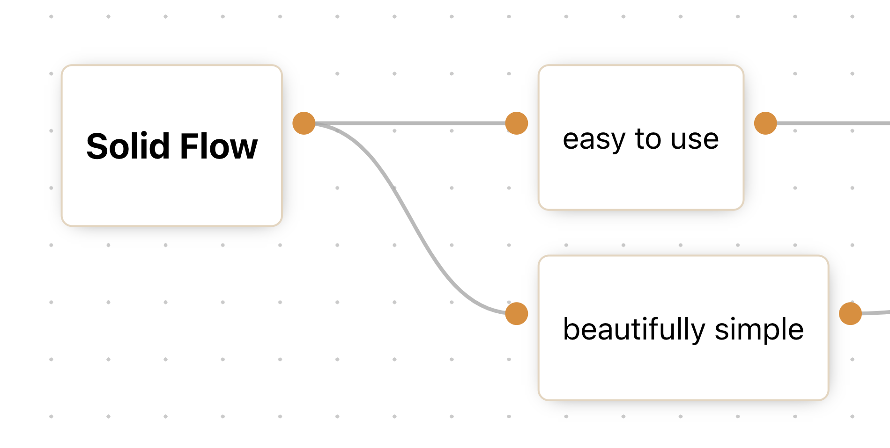

<div style="border-radius: 6px; overflow:hidden; height:247px; margin-bottom: 16px">

</div>

<div align="center">

A simple yet complex [Solidjs](https://www.solidjs.com/) component for building interactive node-based diagrams and editors

[📖 Documentation](https://miguel-vieira.gitbook.io/solid-flow/) | 
[🧪 Demo](https://solidflowdemo.netlify.app/)

</div>

---

## Installation

To install it, simply run

```bash
$ npm install solid-flow
```

## Usage

A very simple example to get started with solid-flow. If you want to check out more complex examples plese refer to [examples](#examples)

```javascript
import { createEffect, createSignal } from "solid-js";
import { SolidFlow } from "solid-flow";
import styles from "./styles.module.css";

const initialNodes = [
    {
        id: "node-1",
        position: { x: 50, y: 100 },
        data: {
            content: <p>This is a simple node</p>,
        },
        inputs: 0,
        outputs: 1,
    },
    {
        id: "node-2",
        position: { x: 350, y: 100 },
        data: {
            label: "Node with label",
            content: <p>This is a node with a label</p>,
        },
        inputs: 1,
        outputs: 0,
    },
];

const initialEdges = [
    {
        id: "edge_node-1:0_node-2:0",
        sourceNode: "node-1",
        sourceOutput: 0,
        targetNode: "node-2",
        targetInput: 0,
    },
];

const Example = () => {
    const [nodes, setNodes] = createSignal(initialNodes);
    const [edges, setEdges] = createSignal(initialEdges);

    return (
        <div class={styles.main}>
            <SolidFlow
                nodes={nodes()}
                edges={edges()}
                onNodesChange={(newNodes) => {
                    setNodes(newNodes);
                }}
                onEdgesChange={(newEdges) => {
                    setEdges(newEdges);
                }}
            />
        </div>
    );
};
```

<a name="development"></a>

## Development

To begin development first you need to `git clone` this repository to your local machine. Once that's done, on the main directory, run

```bash
npm install
```

to install the packages and then run

```bash
npm start
```

to rollup the project.

From here, everytime a change is made the project will be built automatically. To test it out follow the instructions on [examples](#examples) and use of the examples as a development template.

<a name="examples"></a>

## Examples

You can run the examples on your local machine and tinker with them or if you simply want to have a look, you can go directly to the [demo page](https://solidflowdemo.netlify.app/).
To run the examples first make sure your've gone trough all the steps explained in [development](#development). Once you've got that set up then go to the examples directory

```bash
cd examples
```

Install it

```bash
npm install
```

and run it

```bash
npm start
```

you should now be able to check it out on your [localhost](http://127.0.0.1:3000/). You can use the examples as a template for development.

## Credits

Credits go to [Product Dock](https://productdock.com/) by giving the means to be able to build this project.